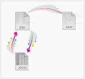

##  Introduction {#_introduction}

Kilt is a set of small tools to ease the handling of Java i18n resource
bundles.

It can help by

-   Converting i18n resource bundles to and from XLS(X) sheets for
    easier translation by a small translation team.

-   Providing a facade to access the entries in a i18n resource bundle
    statically in a type safe way.

-   Reformatting and reordering entries in resource bundles to maintain
    a constant style and order.

Kilt is available as:

-   a standalone application

-   an ant task to be integrated with an ant-based application

-   a maven plugin to be integrated with a maven-based application

### Translation workflow support {#_translation_workflow_support}

Kilt supports the translation workflow inside a company by providing the
translation resources (Java i18n resource bundles) as a more
translator-friendly XLS(X) sheet. The translation team can then do their
translations directly inside the XLS(X) sheet. The translated sheet can
then be imported back into the actual resource bundles used by the
application.



By utilizing the [Apron]() library the
import of the XLS(X) file into the Java i18n resource bundles is
minimally invasive. It does not change the order of the entries in the
resource bundles and all comments and empty lines are preserved.

The same is true for the export to XLS(X). No reordering is done to
entries that already exist in the sheet and all cell sizes, colors etc.
remain as they are.

### Type-safe access to i18n resources {#_type_safe_access_to_i18n_resources}

The usual approach of accessing translated resources in Java uses
strings and is therefore quite error-prone. Typos are common and the
software developer needs to know the exact name of the resource bundle
key.

Kilt eases the usage of translated resoures by allowing to generate enum
facades for resource bundles to allow type-safe access to these
resources. This approach not only shows problems with localization at
compile time, but it is also easy for the developers to find the
necessary resources by utilizing the code completion of modern IDEs.

The generated enum facades even contain the actual translated values in
the javadoc of the facades enum values and therefore make it even
easier to spot if the selected resource contains the correct value for
the intented purpose.

For example instead of

```java
final ResourceBundle bundle= ResourceBundle.getBundle("messages");
final String msg= bundle.getString("msg.confirm_deletion");
```

you would write

```java
final I18n i18n= new I18n();
final String msg= i18n.get(Khm.MSG_CONFIRM_DELETION);
```


### Reformatting and Reordering {#_reformatting_and_reordering}

The formatting and the order of the entries in the resource bundles may
deviate over time when different developers are working on it. While
this is more of a cosmetic problem, it still reduces the readability and
comparability of the resource bundles.

Kilt uses the [Apron]() library to
provide commands for reformatting and reordering the entries in the
resource bundles to reintroduce consistency.
